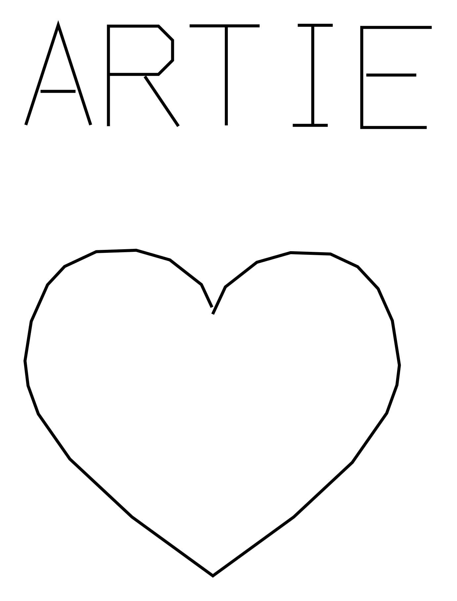
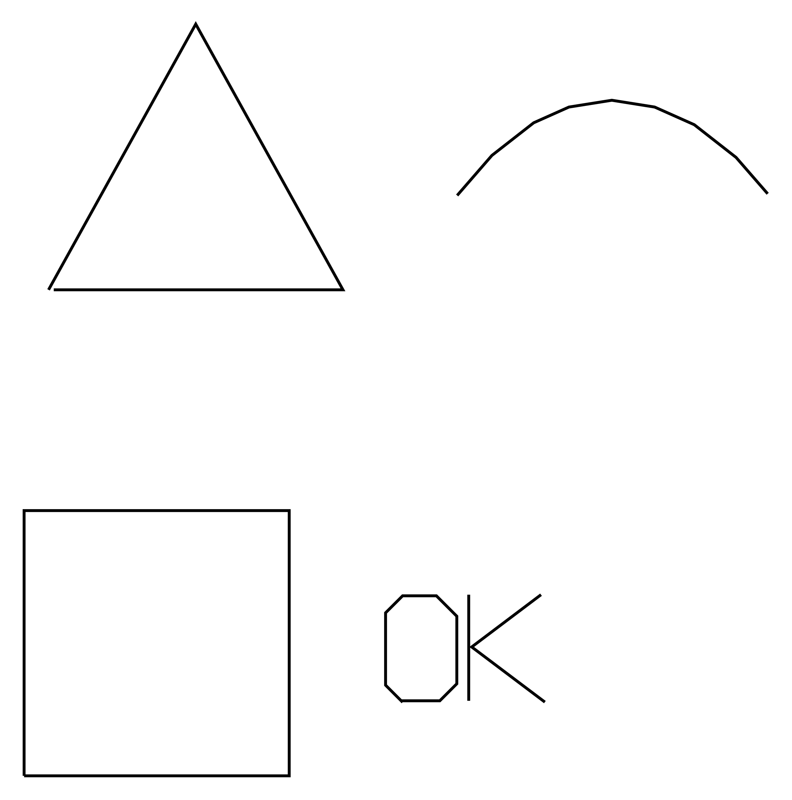

# smartie-3000

**Teaching a £60 toy robot to draw, and teaching a language model to use it.**



The Artie 3000 is a kids' toy: a wheeled robot that holds a felt pen and ships with a Blockly editor. It knows how to go forward, turn, and lift a pen. That's the whole vocabulary.

This project builds everything between *"draw a heart"* and those four commands — an SVG renderer, a stroke font, a motion planner, a calibration system — and then hands the result to a language model.

The MCP server at the end is the easy part. Everything underneath it is the work.

---

## A short history of a forgotten robot

Artie 3000 was unveiled by [Educational Insights at CES in January 2019](https://www.prnewswire.com/news-releases/educational-insights-unveils-new-coding-robot-artie-3000-and-a-partnership-with-american-mensa-at-ces-2019-300774589.html) and shipped that spring at $69.99, aimed at 7–12 year olds. The pitch was neat: kids code, Artie draws. Four real languages — Blockly, Snap!, JavaScript and Python — served from a web server inside the robot itself, no internet required.

It got a genuinely charming amount of attention. American Mensa gave it an **honorary membership** in April 2019 — the first robot ever to get one, and only the third character, after Lisa Simpson and Mr. Peabody. *Good Housekeeping*'s engineers named it a favourite. The toy press liked it. It won things.

**How many were sold is anyone's guess.** Educational Insights never published a figure, and nobody else did either. That absence is its own kind of answer.

Because then it just... faded. Educational Insights moved on to **Artie Max** — rechargeable, three markers, actual sensors, line detection — and quietly discontinued the 3000. Today it's an eBay item. The whole public trace of anyone hacking on it amounts to a handful of GitHub repos with zero or one star each.

Which is a shame, because **the hardware was never the limitation.** Underneath the kids' Blockly editor sits a clean WebSocket API, inherited (undocumented, and evidently unintentionally) from [Mirobot](https://github.com/mirobot), an open-source Kickstarter robot from 2014. Educational Insights never advertised this. As far as I can tell, they never even mentioned it.

The real constraint was that a nine-year-old had to write the code.

That constraint is gone now. The robot that was built so children could learn to program turns out to be a perfectly good pair of hands for a machine that already knows how. Same motors, same protocol, same $69 of plastic — and the awkward part was never the drawing. It was the coding. Which is exactly the part that got automated.

---

## What's actually in here

### An SVG renderer for a robot that can't draw curves

Artie only drives in straight lines. There's no arc command — we checked, the firmware rejects it. So every curve has to become a polyline, and *how* you do that turns out to matter enormously.

The first heart we drew compiled to **646 commands**. Each one is a round-trip that blocks until the wheels physically stop, so it would have taken minutes, and the robot would have jittered its way around a shape a felt tip can't resolve anyway.

The fix is two-stage: flatten curves coarsely, then run Ramer–Douglas–Peucker simplification over the result to collapse the near-straight runs that flattening always over-produces. Same heart, **54 commands**, same shape.

Supports `M L H V C S Q T A Z`, absolute and relative. Fills, strokes and styling are deliberately ignored — it's a pen on wheels; there's nothing to fill with.

### A single-stroke font

Ordinary fonts are outlines meant to be filled. A pen can't fill anything. So the letters here are defined as **the path the pen actually walks** — the same idea as engraving and plotter fonts. A 4×6 grid, scaled from cap height, with word wrapping to the page.

### A motion planner that knows the robot is lying to itself

Artie has **no encoders and no sensors of any kind.** We probed every introspection command in the protocol — `collideState`, `followState`, `getSettings`, battery voltage — and it rejects all of them. It cannot tell you where it is, which way it's pointing, or whether it just drove off the table.

So the planner keeps its own belief about the robot's pose and dead-reckons from the commands it issued. That belief is the only reason "draw a square, then write a caption underneath" puts the caption in the right place.

Everything lowers into one intermediate representation:

```
SVG path ─┐
text      ├─→  StrokePlan  ─→  turtle planner  ─→  forward / left / pen
polygon   │   (polylines, mm)   (x, y, heading,
path      ┘                      pen state)
```

Add a new input format tomorrow — DXF, G-code, whatever — and nothing downstream changes.

### Calibration, because the units are a guess

Artie speaks the [Mirobot protocol](https://learn.mime.co.uk/docs/understanding-the-mirobot-protocol/) — a documented WebSocket protocol from an unrelated open-source robot. Finding that out is what made this project possible at all.

But it's *Mirobot's* docs that say distances are millimetres. Artie's say nothing. So the units are inherited from a different robot, and **if they're wrong nothing errors** — drawings just come out silently the wrong size, and every layer above multiplies the mistake.

```python
artie_calibrate()          # draws a line that SHOULD be 100mm
                           # and a corner that SHOULD be 90 degrees
artie_calibrate(measured_line_mm=94, measured_turn_deg=87)
# -> ARTIE_DISTANCE_SCALE=1.0638
#    ARTIE_TURN_SCALE=1.0345
```

A shape that won't close is the tell. Draw a pentagon — five turns compound the error faster than a square's four.

---

## Getting clean lines

Ink quality is a real engineering problem here, not an afterthought.

**The robot stops dead at every vertex**, pivots, and sets off again. A felt tip sitting still bleeds. There's no continuous-curve command to escape this, so clean output means **stopping fewer times**:

- **Simplification is aggressive by design.** `ARTIE_SIMPLIFY_MM` (default `0.6`) trades curve fidelity for fewer stops. Raise it if you're getting blobs; lower it if circles look faceted.
- **The pen aims before it drops.** The planner used to lower the pen and *then* turn to face the first segment — grinding a blob into the paper at the start of every stroke, 17 of them in a word like "HI ARTIE". Now it turns first and lowers second.
- **Stroke ordering is nearest-neighbour**, so the pen doesn't criss-cross the page between letters.

If lines still look heavy: use a finer pen, and remember that a flat battery makes the motors weak. Short strokes and shapes that won't close look *exactly* like a calibration fault, and get misdiagnosed as one constantly.

---

## Driving it from a language model

The tools are layered on purpose, so a model can work at whatever altitude the task needs.

| | |
|---|---|
| **Drawing** | `artie_draw_svg` · `artie_draw_text` · `artie_draw_polygon` · `artie_draw_path` |
| **Motion** | `artie_forward` `artie_back` (mm) · `artie_left` `artie_right` (deg) · `artie_pen_up` `artie_pen_down` · `artie_stop` · `artie_beep` |
| **Batch** | `artie_run_sequence(["pendown", "forward 100", "left 90", ...])` |
| **Place** | `artie_set_origin` · `artie_where` · `artie_status` |
| **Setup** | `artie_calibrate` · `artie_battery` |



**Every drawing tool takes `preview_only=true`** and returns *an actual image* of what it's about to draw, without moving the robot. The model can look at its own plan and fix it before the pen touches paper. A wrong sentence can be retracted; a wrong line cannot.

### Connecting it up

It speaks [MCP](https://modelcontextprotocol.io), so anything that speaks MCP can drive it.

**Claude Code**
```bash
claude mcp add artie -- uv run --directory /path/to/smartie-3000 python -m smartie3000
```

**Claude Desktop** — in `claude_desktop_config.json`:
```json
{
  "mcpServers": {
    "artie": {
      "command": "uv",
      "args": ["run", "--directory", "/path/to/smartie-3000", "python", "-m", "smartie3000"],
      "env": { "ARTIE_HOST": "192.168.1.123" }
    }
  }
}
```

**GitHub Copilot** (VS Code, agent mode) — in `.vscode/mcp.json`:
```json
{
  "servers": {
    "artie": {
      "command": "uv",
      "args": ["run", "--directory", "/path/to/smartie-3000", "python", "-m", "smartie3000"],
      "env": { "ARTIE_HOST": "192.168.1.123" }
    }
  }
}
```

**Cursor, Windsurf, Zed** — the same JSON block, in their MCP settings.

**Anything else** — MCP servers are just stdio processes speaking JSON-RPC, so use your framework's MCP adapter (LangChain, the OpenAI Agents SDK, and most others have one). Or skip MCP entirely, because the drawing libraries don't depend on it:

```python
from smartie3000.client import ArtieClient, ArtieConfig
from smartie3000.svg import plan_from_svg_path
from smartie3000.strokes import plan_to_commands, Pose

plan = plan_from_svg_path("M 0 0 C 30 -40, 70 -40, 100 0", width_mm=80)
commands, end_pose = plan_to_commands(plan, Pose(20, 20, 90))

client = ArtieClient(ArtieConfig(host="192.168.1.123"))
for cmd, arg in commands:
    await client.send(cmd, arg)
```

The SVG renderer, the font, and the planner are just Python. They have no idea an LLM exists.

---

## Setup

```bash
uv venv && uv pip install -e ".[dev]"
python3 scripts/probe.py          # find the robot, verify the protocol (stdlib only)
export ARTIE_HOST=192.168.1.123
```

**No robot?** `ARTIE_DRY_RUN=1 uv run mcp dev src/smartie3000/server.py` exercises the whole stack — tools, planner, SVG pipeline — with no hardware and no batteries.

### Get Artie onto your WiFi first

Out of the box Artie broadcasts its own hotspot, which means your computer has to *leave* your network — and lose internet — to talk to it. Don't live like that:

1. Join the `Artie-XXXX` hotspot **from your phone**.
2. Open **`http://192.168.4.1`** — Artie's own interface. The WiFi setting is in there.
3. Point it at your home network and save.

Artie joins your LAN and keeps its hotspot as a fallback. Find its new address (`scripts/probe.py`, or your router's DHCP table), set `ARTIE_HOST`, and never switch networks again.

> Artie's firmware is *derived* from Mirobot's but isn't identical. Mirobot's admin pages (`/admin/wifi.html`) don't exist here, and every sensor command is rejected. Assume the motion subset and nothing more.

---

## The protocol

```
ws://<artie>:8899/websocket
-->  {"cmd": "forward", "arg": 100, "id": "abc123"}
<--  {"status": "accepted", "id": "abc123"}      # motion started
<--  {"status": "complete", "id": "abc123"}      # the wheels have STOPPED
```

Confirmed on real hardware, firmware `3.1.21`. Two properties drive the whole transport design:

- **Asynchronous.** `complete` arrives only when the wheels physically stop — 100mm takes about 2.5 seconds. The client waits for it.
- **Single-tasking.** A second move sent before the first finishes is rejected outright. Motion is serialised behind a lock.

Distance costs time; complexity is nearly free. A 33-segment circle and a 4-segment square both took 18 seconds, because both drew about the same length of line.

---

## Three bugs the paper taught us

None of these threw an exception. They just came out **wrong on the paper** — which is the whole character of working with a body instead of a text box.

**The second drawing came out rotated 180°.** The planner assumed the robot began every drawing facing "up the page". But a square leaves it facing the *opposite* way, so a heart followed by a caption produced an upside-down caption. Silently. Fixed by tracking pose across drawings.

**"Absolute" coordinates were ignored.** A triangle at `(0,0)` and the same triangle at `(500,500)` emitted *byte-identical* commands. The docstring promised page positioning; the code delivered "wherever the robot happens to be standing".

**Rounding accumulated into a visible tilt.** The robot takes integers; the planner emits floats (`forward 3.7`). Rounding each command independently throws away up to half a unit *every time*, and over ~140 commands the heading drifted several degrees — text came out slanted. The client now carries the remainder into the next command, so the error stays bounded.

That last one was caught only by **rendering the output and looking at it.** The test suite passed 68/68 with the bug present.

---

## Tests

```bash
uv run pytest        # 73 tests
```

Two do the heavy lifting:

- **`tests/fake_artie.py`** — an in-process robot speaking the real protocol, which can be told to stall, drop the connection, or reject commands on cue. The transport was once the only untested module, and that is exactly where every serious bug was hiding.
- **`replay()`** — takes the commands *actually issued*, drives a simulated turtle with them, and checks the pen visits the planned points. It catches sign errors and heading drift that reading a command list never would.

## What's next

**A camera.** The robot is blind, so calibration and drift correction both still need a human. But the paper is a ruler — A4 is exactly 210×297mm — so one photo, rectified against the sheet's own corners, gives real millimetres. That closes the loop: draw, look, correct, repeat, with nobody holding a ruler.

## Credits

The protocol work rests on [Mirobot](https://github.com/mirobot) (Mime Industries), and on two projects that proved an Artie 3000 speaks it: [`Artie3000_WiiRemote`](https://github.com/majki09/Artie3000_WiiRemote) and [`rogerhoward/artie3000`](https://github.com/rogerhoward/artie3000). The stroke-font idea comes from [`writing-with-artie`](https://github.com/tomhannen/writing-with-artie).

Artie 3000 is a product of Educational Insights. This project is unaffiliated.
